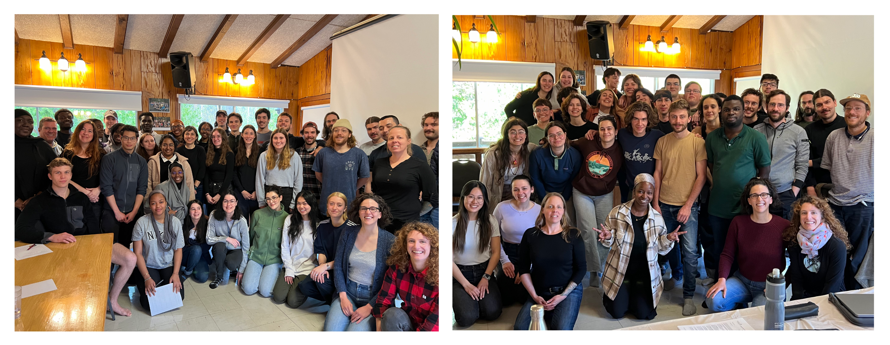

# Comment parcourir ce document

-   L'objectif de ce document est de vous offrir une vue d'ensemble des données physiques collectées par chacun d'entre vous lors du cours Terrain I 🤓

-   La table de matière, située dans le coin en haut à gauche 👈, vous permet de circuler aisément à travers les différentes sections.

-   L'usage des produits Plotly (une entreprise montréalaise 😎) vous permet d'interagir avec les diagrammes. Il suffit de passer le curseur sur l'image pour voir des détails s'afficher, comme par exemple: le nom du lac, le nom de l'équipe responsable de l'échantillon ou des valeurs spécifiques.

-   Nous espérons que notre travail vous inspirera à vouloir utiliser la programmation R 🫶🏻

-   Un monde de possibilité et de découverte vous attend! 🤩

# Tableau \| Base de données commune

Ce tableau contient toutes les données recueillies par les 6 équipes du groupe A et B. Ensemble, nous avons échantillonné 10 lacs différents, pour un total de 66 observations. 👏

Ces lacs incluent 3 lacs protégé dans le secteur de la SBL (lac Croche, Cromwell, Triton et Geai) et 6 lacs anthropisé, hors de la SBL.

Nous avons mesuré plusieurs variables, portant sur la chimie de l'eau, la communauté de zooplancton, et les émissions de CO₂ vers l'atmosphère

```{r, warning=FALSE, message=FALSE}

# Importer les libraries dont nous avons besoin
library(tidyverse) # librairie de visualisation de données
library(plotly) # permet de rendre les diagrammes interactifs
library(readxl) # permet d'ouvrir des fichier excel
library(DT) # produit des tableau interactifs


# Ouvrir la base de données commune
data <- read_xlsx("Data/donnees_td_edited.xlsx") # ouvrir la base de données

data$Date=as.Date(data$Date) # formater les dates

theme_set(theme_bw(base_size = 14)) #spécifier le thème des diagrammes

datatable(data, options = list(pageLength = 5), filter="top") %>%  # Afficher le tableau interactif
  formatStyle(columns = colnames(.$x$data), `font-size` = '12px')

```

# Carte \| Où avons-nous échantillonné?

Grâce a cette carte, vous pouvez identifier vos sites d'échantillonnage et repérer ceux de vos collègues également.

```{r, warning=F, message=F}

library(leaflet)
library(htmltools)

carte=leaflet(data = data) %>%
   addTiles() %>%

   addCircleMarkers(
      ~LONGITUDE, ~LATITUDE, 
      radius=~5 , 
      color= c(rep("purple", 25), rep("orange",41)),
      label = ~htmlEscape(EQUIPE),
      stroke = F,
      fillOpacity = 1
          ) %>%
  addLegend("bottomright", 
            colors = c("purple","orange"),
            labels = c("A", "B"),
             title = "Groupe")

carte
```

# Diagramme à moustache \| Conductivité de l'eau

La conductivité de l'eau représente sa capacité à conduire le courant électrique. Elle est directement liée à la quantité d'ions dissous dans l'eau. L'épandage de sel sur les routes en hiver créer un apport élevé en sel (ions Na+ et Cl-) dans les eaux de ruissellement qui finissent par se jeter dans les lacs. La conductivité de l'eau était en moyenne 5 fois plus élevée dans les lacs à l'extérieur qu'à l'intérieur de la SBL.

```{r,warning=F}
boxplot= ggplot(data=data,
         aes(x = SECTEUR, y = Conductivite, fill = SECTEUR,
              labels = NOM_DU_LAC, text=EQUIPE)) +
              geom_boxplot() +
              geom_jitter()+
              scale_fill_manual(values = c("SBL" = "#1984c5", "HSBL" = "#c23728")) +
              theme( legend.position = "none",
              ) +
  xlab("Secteurs") +
  ylab("Conductivité (uS/cm)")

ggplotly(boxplot, tooltip = c("y", "labels", "text"))

```

## Nuage de point \| Conductivité de l'eau

Le ratio de drainage (aire du bassin versant / aire du lac) ne semble pas avoir d'impact sur la conductivité de l'eau pour les lacs dans la SBL, mais il semble être négativement corrélé à celui de la conductivité dans les lacs hors de la SBL. Un lac avec un grand ratio de drainage a un grand bassin versant par rapport à sa superficie. Par exemple, on observe que le lac rond avait la conductivité la plus élevée, autant lors de l'échantillonnage du groupe A que B.

Généralement, on observe la relation contraire pour l'apport en nutriment, phosphore et azote! Cela pourrait être dû à un effet de dilution (les lacs avec de grands ratios de drainage stockent généralement un plus large volume d'eau) ou dû à la configuration du réseau routier autour des lacs. Il y a aussi des différences entre le moment de la fonte entre ces lacs qui pourrait jouer un rôle.

```{r, warning =F, message=FALSE}

scatterplot <- ggplot(data=data,
               aes(x = Ratio_Drainage, y = Conductivite, 
                  fill = SECTEUR, labels = NOM_DU_LAC, text=EQUIPE)) + 
                geom_point(size = 3) +
                scale_shape_manual(values=c(21,23))+
                scale_fill_manual(values = c("SBL" = "#1984c5", "HSBL" = "#c23728"))+
                labs(  x = "Ratio de drainage",
                       y = "Conductivité (uS/cm)"
                )

ggplotly(scatterplot,tooltip = c("labels", "text"))

```

# Diagramme de sucette \| Zooplancton

Malgré que plusieurs études indiquent que la présence humaine aux abords d'un lac a un impact direct sur la richesse spécifique de la communauté de zooplancton des lacs, nos données ne semblent pas confirmer cet effet. Le nombre d'espèces de zooplancton identifié dans les lacs hors de la SBL est similaire à ceux de la SBL.

Avez-vous trouvé autant d'espèces de zooplancton que vos collègues?

```{r, warning=FALSE, message=F}

# Réorganiser les données
data_loli_zoo <- data %>%
  rowwise() %>%
  group_by(NOM_DU_LAC) %>%
  summarise(
    mean = mean(Richesse_Spécifique, na.rm = T),
    min = min(Richesse_Spécifique, na.rm = T),
    max = max(Richesse_Spécifique, na.rm = T)
  )

# Faire le graphique
cleveland_dotplot_zoo <- ggplot() +
  geom_segment(data = data_loli_zoo, aes(
    x = NOM_DU_LAC, xend = NOM_DU_LAC,
    y = min, yend = max
  ), color = "grey") +
  geom_point(
    data = data,
    aes(
      x = NOM_DU_LAC, y = Richesse_Spécifique,
      color = GROUPE, label = EQUIPE
    ), size = 3
  ) +
  scale_color_manual(values = c("A" = "purple", "B" = "orange")) +
  scale_y_continuous(breaks = seq(0, 10, 1)) +
  coord_flip() +
  ylab("Richesse Spécifique Zooplancton") +
  xlab("Nom du lac")


ggplotly(cleveland_dotplot_zoo, tooltip = c("label", "y"))


```

# Diagramme de sucette \| Flux de CO₂

Malgré quelques difficultés techniques lors de la deuxième semaine, les données des chambres flottantes indiquent que certains lacs étaient bel et bien de grandes sources de CO₂ vers l'atmosphère (p.ex Triton) alors que d'autres étaient parfois de faibles puits de CO₂ (p.ex Croche et Connelly)

```{r, warning=F, message=F}

# Réorganiser les données
data_loli = data %>% 
  rowwise() %>% 
  group_by(NOM_DU_LAC)%>%
  summarise( mean = mean(Flux_CO2, na.rm = T),
          min = min(Flux_CO2,na.rm = T),
          max = max(Flux_CO2,na.rm = T)) #%>% 


# Faire le graphique
cleveland_dotplot=ggplot() +
  geom_abline(x=0)+
  geom_segment(data=data_loli, aes(x=NOM_DU_LAC, xend=NOM_DU_LAC, 
                    y=min, yend=max), color="grey") +
  
  geom_point(data=data, 
             aes(x=NOM_DU_LAC, y=Flux_CO2, 
                 color=GROUPE, label=EQUIPE), 
              size=3 ) +
  
  scale_color_manual(values = c("A"="purple", "B"="orange"))+
  
  coord_flip()+

  ylab("Flux de CO2 (mg C /m2 /jr)")+
  xlab("Nom du lac")

 # cleveland_dotplot

ggplotly(cleveland_dotplot, tooltip = c("label", "y"))

```

# Mot de la fin

Merci de nous avoir lu et pour votre participation au cours. Nous vous souhaitons une bonne continuité dans vos études.

Au plaisir de vous croiser sur le campus!

{fig-align="center" width="350"}
